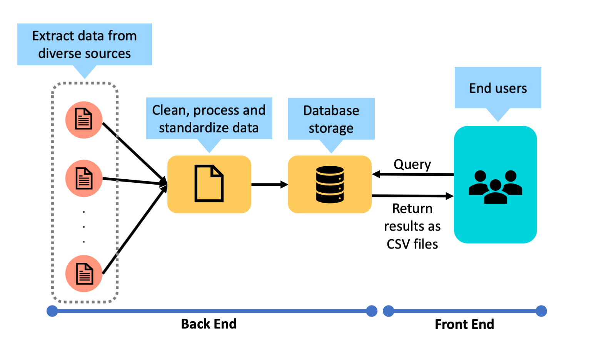

# GDA-assignment
 Take-home Assignment for Data Engineer Intern

# How to run
## Installation
1. MongoDB needs to be installed, as it will be used for storing and querying data (https://www.mongodb.com/docs/manual/administration/install-community/)
2. Pymongo and Pandas need to be installed too. To install, run command:
```
pip3 install pymongo pandas
```
## Running code
Download both `Country-Code.xlsx` and `code.py` into the same folder, then navigate to the folder in Terminal, and run:
```
python3 code.py
```
## Output
1. Running the code will create a database named **Restaurants** in MongoDB locally, containing 2 collections **restaurants** and **countrycode**.
2. The following CSV files will also be saved into the same folder where `code.py` is:
    * restaurants.csv
    * restaurant_events.csv

    (\* Note: The *Photo URL* field in restaurant_events.csv is assumed to be the URL of the first photo of the event if any, as some events have multiple photos.)
3. The thresholds for the ratings will be printed in the Terminal after running the code.

# Design for deployment
In the given case study scenario, the data was only collected from a single source, Zomato, and we only needed to store the fields we are interested in in CSV files. Hence the code implements a one-time process where we simply first import the provided JSON data into a NoSQL database before directly querying the database to get the relevant data into each CSV file.

However, in the long run, the travel blogger may want to get data on restaurants from other different sources as well, and it is not computationally ideal to load and process all the raw data from the data sources every time we want to retrieve the CSV files with updated records. Hence, we can process and store the data in a database and update it at scheduled intervals, so that we would only need to query the database to retrieve the records as CSV files. 
## 1. Extract raw data and process them
Raw data can be scraped at scheduled intervals from diverse sources. To integrate data obtained from different sources, the raw data will be cleaned and reformated so that they become standardized, since the raw data from different sources have different formats and field names. Duplicated data would also be removed.
## 2. Store processed data and update database
To decide what kind of database to use to store the processed data, we need to consider how the travel blogger is going to use the data. If he is only interested in the fields specified in the CSV files and the fields are not likely to change over time, then storing the structured data in a relational database is sufficient. However, if the blogger wishes to have more flexibility in the data he collects, then storing the processed data in a NoSQL database would be better due to its dynamic schema. For example, NoSQL would make it possible to insert new attributes of restaurants in the future, such as users' comments or food critics' reviews, since it does not have a predefined schema. 

These pipelines to ingest, process and store data can be implemented in the cloud.

## 3. Retrieving CSV files
Finally, whenever the blogger wants to retrieve information about restaurants at the front end, it would just be a matter of querying the database which can be done efficiently. 

## Overall Diagram

